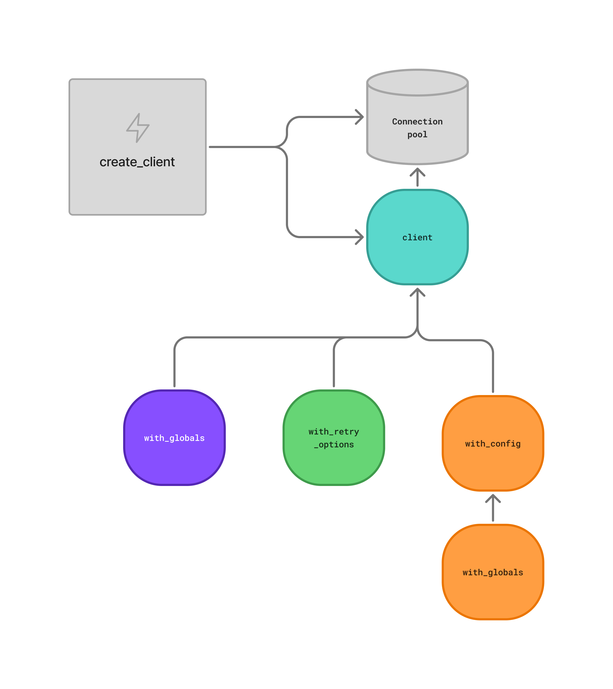

.. _ref_clients_index:
.. _ref_using_clients:

=================
Client philosophy
=================

To connect your application to a |Gel| instance, you can use one of our official client libraries that speaks the Gel binary protocol. The client libraries are higher level than typical database drivers, and are designed to provide a fully-featured API for working with |Gel| instances.

* Connecting is easy
* Transactions are robust
* Many client instances, single connection pool

Connecting is easy
==================

Typical database drivers require you to figure out how to pass the correct connection string (called a DSN, or data source name) to the driver. This is a bit of a pain, and is error prone.

Our client libraries take a different approach. Instead of needing to pass a DSN into our client creation function, the client libraries use a convention to discover the connection information in a way that allows you to not have to vary the code you write based on where you run your application.

.. tabs::

  .. code-tab:: typescript
    :caption: TypeScript

    import { createClient } from "gel";

    const client = createClient();

    const result = await client.queryRequiredSingle("select 42");

  .. code-tab:: python
    :caption: Python

    import gel

    client = gel.create_client()

    result = client.query_required_single("select 42")

    client.close()

  .. code-tab:: go
    :caption: Go

    package main

    import (
        "context"

        "github.com/geldata/gel-go"
        "github.com/geldata/gel-go/gelcfg"
    )

    func main() {
        ctx := context.Background()
        client, err := gel.CreateClient(gelcfg.Options{})
        if err != nil {
            log.Fatal(err)
        }
        defer client.Close()

        var (
            answer int64
        )

        query := "select 42"
        err = client.QuerySingle(ctx, query, &answer)
    }

  .. code-tab:: rust
    :caption: Rust

    #[tokio::main]
    async fn main() -> anyhow::Result<()> {
        let conn = gel_tokio::create_client().await?;
        let val = conn.query_required_single::<i64, _>(
            "select 42",
            &(),
        ).await?;

        Ok(())
    }

* Local development: We suggest using our :ref:`projects <ref_guide_using_projects>` feature to manage your local instance. We handle creating credentials, and clients automatically know how to resolve the connection information for projects initialized in your project directory. We also support Docker Compose.
* Production: For production, we recommend using environment variables to specify connection information to your |Gel| Cloud instance or remote self-hosted instance.

This approach allows you to write code that does not need to contain any error-prone conditional logic. For more information on how to configure your connection for development and production, see :ref:`the reference for connection environments <ref_reference_connection_environments>`.

Transactions are robust
=======================

Transactions are an important part of working with databases. In Gel, all queries are automatically run in an implicit transaction, ensuring atomicity and isolation for individual operations. We use the safest isolation level of ``SERIALIZABLE`` to ensure consistent results across high-concurrency scenarios. Additionally, our client libraries provide a higher-level API for working with explicit transactions when you need to group multiple operations together.

Our client libraries are designed to automatically retry failures for certain classes of transaction errors. For instance, one common failure mode is a serialization error, which can happen when two transactions that are trying to modify the same data attempt to commit at the same time. The database will pick one of the transactions to commit, and the other will fail. In typical database drivers, you would need to handle this in your application code, but in our client libraries, you don't need to worry about it: we will simply retry the transaction for you in this case.

The behavior of transaction retries can be customized in the client configuration, which we will detail in full in the documentation for each client library.

.. tabs::

  .. code-tab:: typescript
    :caption: TypeScript

    import { createClient } from "gel";

    const client = createClient();

    await client.transaction(async (tx) => {
      await tx.execute("insert User { name := 'Don' }");
    });

  .. code-tab:: python
    :caption: Python

    import gel

    client = gel.create_client()

    for tx in client.transaction():
        with tx:
            tx.execute("insert User { name := 'Don' }")

  .. code-tab:: go
    :caption: Go

    package main

    import (
        "context"
        "log"

        "github.com/geldata/gel-go"
        "github.com/geldata/gel-go/geltypes"
    )

    err := client.Tx(ctx, func(ctx context.Context, tx geltypes.Tx) error {
      return tx.Execute(ctx, "insert User { name := 'Don' }")
    })
    if err != nil {
      log.Println(err)
    }

  .. code-tab:: rust
    :caption: Rust

    let client = gel_tokio::create_client().await?;

    client
        .transaction(|mut conn| async move {
            conn.execute("insert User { name := 'Don' }", &()).await?;
            Ok(())
        })
        .await?;

Many client instances, single connection pool
=============================================

When you create a client, you also establish a connection pool to the Gel server. Since this is resource-intensive, you can create a single client instance and then derive lightweight instances that share the same connection pool. Each derived instance can have different configurations, allowing customization without additional overhead.

You can configure various aspects of these client instances at runtime, including:
- Setting global variables
- Adjusting query timeouts
- Disabling access policies
- And other client-specific options

